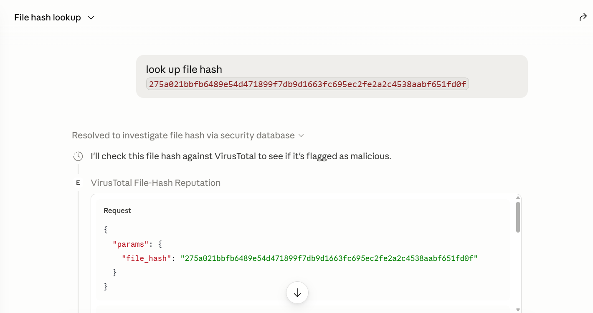
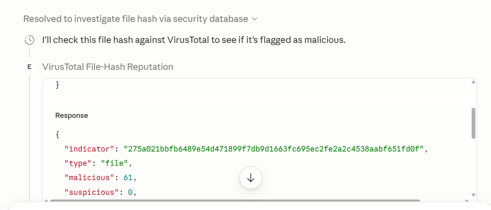

# enrichment-mcp

A small, local **MCP server** that wraps the [VirusTotal v3](https://docs.virustotal.com/reference/overview)
reputation API as tools an LLM agent can call during an investigation.

It's the **enrichment layer** for this repo. The YARA harness one level up detects
malicious *patterns*; this answers the next question a real investigation asks —
*"that rule fired — is the indicator it surfaced (a hash, a URL) actually
known-bad?"* One source today (VirusTotal), but the tool interface is built so
more reputation sources could slot in behind the same normalized verdict.

> Self-contained: this folder has its own dependencies and does not touch the
> harness or its CI. It is not exercised by the repo's pytest suite.

## Tools

| Tool | Input | Returns |
|---|---|---|
| `vt_lookup_file_hash` | `file_hash` (MD5 / SHA-1 / SHA-256) | normalized verdict |
| `vt_lookup_url` | `url` (incl. scheme) | normalized verdict |
| `vt_lookup_ip_address` | `ip` (IPv4) | normalized verdict |
| `vt_lookup_domain` | `domain` | normalized verdict |
| `lookup_indicator` | `indicator`, `type` | multi-source envelope: each source's verdict + a consensus |
| `extract_indicators` | `text` | URLs / IPs / domains in the text (no network) |
| `investigate_sample` | `text`, `max_indicators`, `delay_seconds`, `all_sources` | extract + chain a lookup per indicator → aggregated report (opt into multi-source fan-out with `all_sources`) |

The four `vt_lookup_*` tools return the **same normalized shape** — the answer, not
VirusTotal's raw 500-field blob:

```json
{
  "indicator": "44d88612fea8a8f36de82e1278abb02f",
  "type": "file",
  "malicious": 62,
  "suspicious": 0,
  "harmless": 0,
  "undetected": 8,
  "reputation": -875,
  "flagged_by": ["ALYac", "AVG", "Avast", "BitDefender", "ClamAV"],
  "permalink": "https://www.virustotal.com/gui/file/44d88612fea8a8f36de82e1278abb02f"
}
```

All tools are **read-only**: the lookups only *query* reputation (nothing is
submitted, modified, or deleted), and `extract_indicators` makes no network call
at all.

## Multi-source lookup

`lookup_indicator` is the multi-source front door: give it one `indicator` + its
`type` and it fans out across every configured reputation source, returning an
**envelope** — each source's verdict under the *same* normalized shape above, plus
a `consensus`:

```json
{
  "indicator": "192.0.2.44",
  "type": "ip_address",
  "sources": {
    "virustotal": { ...normalized verdict... },
    "urlhaus":    { ...normalized verdict... }
  },
  "consensus": {
    "malicious": true, "suspicious": false,
    "sources_malicious": ["urlhaus", "virustotal"], "sources_suspicious": [],
    "max_malicious": 7,
    "sources_completed": ["urlhaus", "virustotal"], "sources_skipped": [], "sources_errored": []
  }
}
```

Counts are **never merged** across sources (VirusTotal engines and URLhaus
blacklists aren't comparable) — `consensus` only summarizes: which sources called it
malicious/suspicious, the `max` malicious count seen (not a sum), and which sources
completed, were skipped (no key), or errored. A source with no API key is silently
skipped, and one source's error never sinks the others.

**Sources wired in today:** VirusTotal (`VT_API_KEY`; all four kinds) and URLhaus
(`URLHAUS_API_KEY`; url / ip / domain). Set either, both, or neither — with no keys
the tools return an actionable message; with one, the envelope carries that one
source. See [`multi-source-design.md`](multi-source-design.md) for the full design,
the source/key roster, and the rollout (urlscan and Censys next).

## Chained investigation

`investigate_sample` is the "auto-extract + chain" step after a YARA rule fires: hand
it a flagged sample's **text** and it extracts the indicators (same logic as
`extract_indicators`), looks each up sequentially (unpaced by default — set
`delay_seconds` to pace for the free-tier rate limit; ~15 stays under ~4/min),
and returns one aggregated report:

```json
{
  "summary": {"indicators_found": 2, "looked_up": 2, "skipped_for_cap": 0,
              "malicious": 1, "suspicious": 0, "clean_or_unknown": 0,
              "not_found": 1, "errors": 0},
  "results": [
    {"indicator": "http://192.0.2.77/install.sh", "type": "url", "verdict": { ... }},
    {"indicator": "192.0.2.44", "type": "ip_address", "error": "Not found: ..."}
  ],
  "skipped": [],
  "note": "Looked up 2 of 2 indicators sequentially, with no pacing delay (set delay_seconds to pace); VT free tier is ~4/min, 500/day."
}
```

Each result carries a `verdict` *or* an `error`, so one indicator's 404/429 never sinks
the rest. Extraction pulls URLs, bare IPv4s, and email domains; a host inside a URL is not
re-counted, and standalone bare-domain scanning is skipped (dotted code identifiers like
`System.Net.WebClient` are indistinguishable from domains without a TLD list).

Pass **`all_sources: true`** to fan out across *every* configured source per indicator
(the `lookup_indicator` fan-out): each row then carries `sources` + `consensus` instead
of a single `verdict`, and the summary tally is derived from each row's consensus. The
default stays VirusTotal-only.

**Defanged-corpus caveat:** the repo's corpus is synthetic — RFC 5737 `192.0.2.x`,
`*.example.*`, fake tokens — so live lookups on it mostly return `not_found`. That is
expected: it proves the extract → chain → aggregate *wiring*, not real detections. Point
it at a real sample to see real verdicts.

### End-to-end demo (YARA → investigate)

`investigate_demo.py` ties this to the harness: it compiles the repo's YARA rules,
scans the corpus, and runs `investigate_sample` on each *flagged* sample's text — the
full "flag → auto-extract → chain" flow. YARA stays out of the server; only the demo
imports it (a demo-only dep, not in `requirements.txt`):

```bash
pip install yara-python      # demo-only, into the same env as the server deps
python investigate_demo.py   # a key in .env gives live verdicts
```

## Setup

Requires a real Python 3.10+ interpreter (the Windows Store stub won't work).

```bash
cd enrichment-mcp
python -m venv .venv
.venv\Scripts\activate          # Windows;  source .venv/bin/activate on macOS/Linux
pip install -r requirements.txt
```

Provide a free API key for each reputation source you want to use. VirusTotal is
the core source; [URLhaus](https://auth.abuse.ch/) (free abuse.ch Auth-Key) adds a
second opinion for url/ip/domain via `lookup_indicator`. A source with no key is
simply skipped, so setting just `VT_API_KEY` is enough to start.

```powershell
# PowerShell
$env:VT_API_KEY = "your_key_here"
$env:URLHAUS_API_KEY = "your_urlhaus_key_here"   # optional; enables URLhaus
```
```bash
# bash/zsh
export VT_API_KEY="your_key_here"
export URLHAUS_API_KEY="your_urlhaus_key_here"   # optional; enables URLhaus
```

Or copy `.env.example` to `.env` and put the key(s) there (auto-loaded for local
testing; `.env` is gitignored).

## Run / test it

The server speaks **stdio** and is normally launched by an MCP client. To poke
the tools by hand, use the MCP Inspector (with the [Setup](#setup) venv active, so
`python` resolves to the interpreter that has the deps):

```bash
npx @modelcontextprotocol/inspector python server.py
```

In the Inspector, call `vt_lookup_file_hash` with a known test hash (e.g. the
EICAR test file MD5 `44d88612fea8a8f36de82e1278abb02f`) and confirm you get a
normalized verdict back.

### Wire it into Claude Code

This repo ships a project-scoped [`.mcp.json`](../.mcp.json) at its root, so Claude
Code discovers the server automatically — open the project and approve `enrichment-vt`
when prompted. (MCP servers load at session start, so it appears in a *new* session.)
It launches the server with this folder's `.venv` and reads the key from `.env`, so
run [Setup](#setup) first; no key goes in the client config.

The `command` resolves the venv interpreter cross-platform via env-var expansion:
`${ENRICHMENT_VENV_PYTHON:-enrichment-mcp/.venv/Scripts/python.exe}`. The default is
the **Windows** venv path, so Windows works with no extra step. On **macOS/Linux**,
the venv puts Python under `bin/` instead of `Scripts/`, so set `ENRICHMENT_VENV_PYTHON`
to the POSIX path before launching the client (the value still points at this folder's
`.venv`, so it keeps the dependency-carrying interpreter):

```bash
# bash/zsh — set in your shell profile so every session sees it
export ENRICHMENT_VENV_PYTHON="enrichment-mcp/.venv/bin/python"
```

| Platform | venv interpreter used |
|---|---|
| Windows | `enrichment-mcp/.venv/Scripts/python.exe` (default — nothing to set) |
| macOS/Linux | `enrichment-mcp/.venv/bin/python` (via `ENRICHMENT_VENV_PYTHON`) |

For other clients (e.g. Claude Desktop), point them at that same `.venv` interpreter
running `server.py` over stdio; the key is read from `.env` (or pass `VT_API_KEY` in
the client's `env` block).

## Verify it works

Two ways to confirm the tools work after cloning — pick by whether you have a
(free) VirusTotal key. Both run from the repo root.

**No key, no network — the tool logic, deterministically:**

```bash
pip install -r enrichment-mcp/requirements-dev.txt
pytest enrichment-mcp -v
```

`test_server.py` covers the pure helpers; `test_tools.py` drives the `vt_lookup_*`
tools end-to-end with the network stubbed — validation → fetch → normalize →
verdict, plus the missing-key and 404 paths. No API key, no internet; these also
run in CI.

**With a free key — a live call against VirusTotal:**

Put your key in `.env` (see [Setup](#setup)), then drive the real server over stdio:

```bash
python enrichment-mcp/smoke_test.py
```

It connects, lists the tools, and prints a verdict for the EICAR test hash
(dozens of engines `malicious`). Without a key it still connects and the tool
returns the actionable `VT_API_KEY is not set` message — proof the wiring works
either way.

Expected output (with a key):

```
connected to 'virustotal_mcp'
tools: vt_lookup_file_hash, vt_lookup_url, vt_lookup_ip_address, vt_lookup_domain, lookup_indicator, extract_indicators, investigate_sample

looking up EICAR hash 275a021bbfb6489e54d471899f7db9d1663fc695ec2fe2a2c4538aabf651fd0f ...
{
  "indicator": "275a021bbfb6489e54d471899f7db9d1663fc695ec2fe2a2c4538aabf651fd0f",
  "type": "file",
  "malicious": 64,
  "suspicious": 0,
  "harmless": 0,
  "undetected": 2,
  "reputation": 3781,
  "flagged_by": ["ALYac", "APEX", "AVG", "AhnLab-V3", "Alibaba"],
  "permalink": "https://www.virustotal.com/gui/file/275a021bbfb6489e54d471899f7db9d1663fc695ec2fe2a2c4538aabf651fd0f"
}
```

### Live in an MCP client

The same tools wired into Claude Desktop: a natural-language ask invokes the
`enrichment-vt` tool, which returns the normalized verdict (here for the EICAR
test hash).





## Error handling

Every failure mode returns a single actionable line, never a stack trace:

| Situation | Response |
|---|---|
| `VT_API_KEY` unset | `Error: VT_API_KEY is not set. Get a free key at ...` |
| Bad/invalid key (401) | `Error: VirusTotal rejected the API key (401). ...` |
| Rate limited (429) | `Error: VirusTotal rate limit hit (429). The free tier allows ~4/min ...` |
| Indicator unknown (404) | `Not found: '<indicator>' is not in VirusTotal's dataset ...` |
| Timeout / network error | `Error: request to VirusTotal timed out ...` / `network error ...` |

Each source maps its own failures the same way (e.g. `Error: URLhaus rejected the
API key (401). ...`), and within `lookup_indicator` a per-source error becomes that
source's `error` entry without sinking the others.

A transient **429 or 5xx is retried first** — honoring a `Retry-After` header when
present, otherwise bounded exponential backoff, capped at a few attempts — and only
degrades to the one-line message above once retries are exhausted. Lookups share a
single pooled HTTP client (closed on server shutdown) rather than opening a fresh
connection per call, and each **successful** lookup is served through a small
in-process TTL cache — so a repeated indicator (including across an `investigate_sample`
run) reuses the stored verdict instead of re-hitting VirusTotal. Errors are never cached.

## Security notes

- **Key in env, never in code or git.** `.env` is gitignored; `.env.example` is a
  template only.
- **Read-only.** Only reputation *lookups*; no submission or mutation endpoints.
- **Rate-limited by design** on the free tier — handled gracefully (see above).

## Roadmap

Multi-source fan-out is **live** — the adapter interface, the fan-out envelope, and
the `lookup_indicator` tool are in place with **VirusTotal and URLhaus** wired in
(see [`multi-source-design.md`](multi-source-design.md)). Remaining:

- More source adapters behind the same interface: **urlscan**, then **Censys**.
- A **formal eval suite**: an offline golden-file gate in CI, plus an opt-in live-key smoke script.
- Durable cache **persistence** (the in-process TTL cache is in-memory only).
